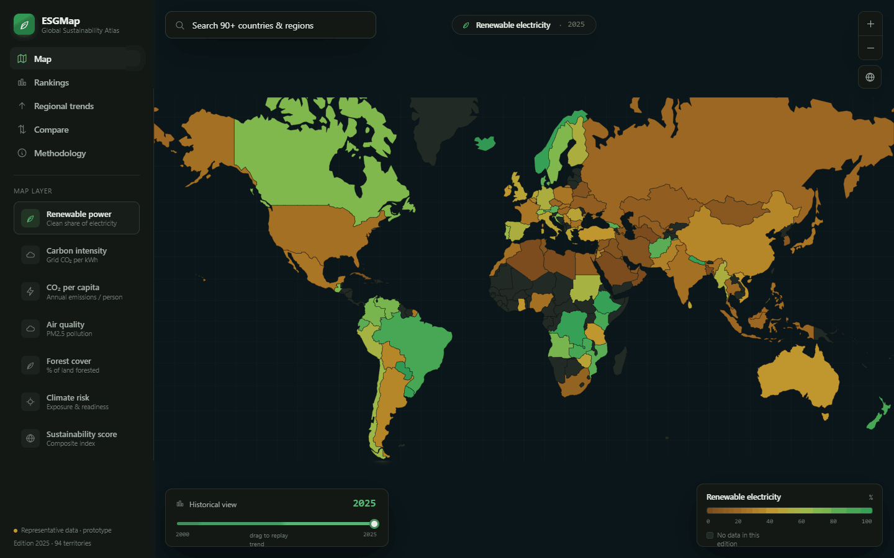

# ESGMap — Global Sustainability Atlas

An interactive, dark-themed world map of national sustainability indicators. Pick one of seven
map layers, the world recolours by that metric, and clicking any country opens a detail panel
with its energy mix, disclosure status, environmental indicators and a 25-year historical trend.
Supporting views add a sortable **Rankings** table, a **Regional trends** overlay, a two-country
**Compare** view, and a **Methodology** page documenting every source with its retrieval date.

Built with **React + TypeScript + Vite + D3**, wired to **real, dated open data**, and deployable
to **GitHub Pages** as a fully static site.



## Highlights

- **Real data, never invented.** Headline metrics are ingested from Our World in Data and the
  World Bank by a reproducible build script; missing values render grey / "no data".
- **Seven map layers** — renewable power, grid carbon intensity, CO₂ per capita, air quality
  (PM2.5), forest cover, climate-risk exposure, and a documented composite score.
- **D3 world map** — `geoMercator`, full-bleed, latitude-clipped to kill polar smear, zoom/pan,
  hover tooltips, click-to-select with fly-to that centres on a country's **largest landmass**.
- **Time slider** scrubs the 2000→latest history for the renewable and carbon layers.
- **Self-hosted geometry & data** — no third-party runtime data calls; one JS bundle + one TopoJSON (decoded to GeoJSON at runtime).

## Tech stack

| Concern | Choice |
|---|---|
| Framework | React 18 + TypeScript |
| Build | Vite 5 (static output, relative base for Pages) |
| Map / scales | `d3-geo`, `d3-zoom`, `d3-scale`, `d3-selection`, `d3-transition`, `topojson-client` |
| Geometry | Natural Earth 110m (`world-atlas`), self-hosted under `public/geo/` |
| Fonts | IBM Plex Sans + IBM Plex Mono |
| Data | Our World in Data (Energy, CO₂); World Bank (forest, PM2.5); curated policy layer |

## Getting started

```bash
npm install
npm run dev        # http://localhost:5173
```

### Scripts

| Command | What it does |
|---|---|
| `npm run dev` | Vite dev server |
| `npm run build` | Type-check (`tsc -b`) + production build to `dist/` |
| `npm run preview` | Serve the production build locally |
| `npm run typecheck` | Type-check only |
| `npm run build:data` | Re-ingest the live open-data feeds → `src/data/countries.json` |
| `npm run build:meta` | Regenerate the curated policy layer from the design handoff |

## Data pipeline

`scripts/build-data.mjs` downloads the open CSV / JSON feeds, normalises them on ISO-3166 alpha-3
codes, maps ISO-3 → Natural Earth `name`, derives the composite score, and emits a single typed
`src/data/countries.json` (imported directly by the app). Every source carries a `retrievedAt`
date that the Methodology view surfaces. See **[DATA_SOURCES.md](DATA_SOURCES.md)** for the full
provenance table, licensing, and the score formula.

```
OWID Energy CSV  ─┐
OWID CO₂ CSV     ─┤
World Bank API   ─┼─►  build-data.mjs  ─►  src/data/countries.json  ─►  app
curated layer    ─┘     (ISO-3 join, derive score, stamp dates)
```

The dataset is committed so the app builds and deploys without network access; the CI workflow
attempts a fresh ingest on each deploy and falls back to the committed copy if a feed is down.

## Near-real-time layer

On top of the annual figures, countries covered by a free **national grid operator** API also
carry a **live** renewable-share reading, refreshed hourly and shown beside the annual value on
the country panel (with a pulsing "LIVE" badge, a map-tooltip indicator, and a "N live now" count
in the sidebar). Instantaneous mix is a snapshot, not a yearly average — so it's labelled
distinctly and never overwrites the annual metric.

| Source | Covers | Token |
|---|---|---|
| National Energy System Operator (`carbonintensity.org.uk`) | United Kingdom | none |
| U.S. EIA Grid Monitor (`api.eia.gov`) | United States | `EIA_KEY` (free, instant) |
| ENTSO-E Transparency Platform (`web-api.tp.entsoe.eu`) | ~25 European countries (incl. zone-summed NO/SE/DK) | `ENTSOE_TOKEN` (free, email request) |

Both **live renewable share and live grid carbon** are surfaced — carbon measured for the UK, and
estimated from the live mix via lifecycle emission factors for EIA/ENTSO-E (shown with a “~”).

`scripts/build-live.mjs` queries these and writes `src/data/live.json` — a small overlay the app
merges on load. **The UK works with no token**, so there is always at least one live country; the
US and EU activate the moment their secrets are present. Each source is guarded by its token and
each country is fetched independently, so a missing key or a bad response never breaks the build —
that country simply stays "annual".

The overlay is regenerated by the deploy workflow (every push **and** hourly via cron) and baked
into the deployed artifact; it is **not** committed, so live data never spams git history.

### Enabling US / EU live data

Add repository secrets under **Settings → Secrets and variables → Actions**:

- `EIA_KEY` — get instantly at <https://www.eia.gov/opendata/register.php>
- `ENTSOE_TOKEN` — email `transparency@entsoe.eu` with subject "RESTful API access" (~3 days), then
  generate the token in your account settings.

```bash
npm run build:live                       # UK only (no token)
EIA_KEY=... ENTSOE_TOKEN=... npm run build:live   # full coverage
```

## For researchers & educators

ESGMap is built to be cited, reused, and taught — not just viewed:

- **Download the data** (Methodology → Download data, or `public/downloads/`): wide CSV, tidy/long
  CSV (R/pandas-ready), full history CSV with an `interpolated` flag, JSON twins, a machine-readable
  **codebook** (`data-dictionary.json`), and a **JSON Schema** (`schema/countries.schema.json`).
  Missing values are an explicit `NA` — never fabricated, never 0.
- **Static "API"** — addressable per-resource JSON at `api/country/<ISO3>.json` and
  `api/metric/<key>.json` (+ `api/index.json`), emitted at build time. No backend.
- **Cite correctly** — one-click **BibTeX / RIS / APA** in Methodology and a per-country "Cite"
  button, crediting ESGMap and every upstream source with retrieval dates. `CITATION.cff` at the root.
- **Deep-link permalinks** — the full app state (layer, year, country, pins, view, palette) lives in
  the URL hash, so any view is a shareable, citable, embeddable link ("Link" button, top-center).
- **Provenance & vintage transparency** — every value shows its **observation year** (forest may be
  2023 while renewables are 2025), carried-forward history is drawn **dashed**, and each score shows
  "scored on N/5 indicators". A content-hash + version + git SHA + `build-manifest.json` make each
  edition verifiable and reproducible (`npm run build:data`).
- **Score Lab** — re-weight the composite with live sliders and watch the ranking move (the answer to
  "is your ranking an artifact of the weights?"). Never overwrites the published score.
- **Validation** — Spearman correlation matrix among the sub-indicators (multicollinearity) and
  convergent validity vs. an external index (Yale EPI), computed client-side.
- **Explore** — scatter any two indicators, coloured by region, with explicit missing-data accounting.
- **Publication-ready** — colourblind-safe (cividis) and greyscale palettes; print stylesheet;
  per-country JSON/print export.
- **Accessible & offline** — screen-reader data-table fallback for the map, keyboard focus rings,
  labelled controls, skip link; installable PWA with a service worker for offline use.
- **Governance & ethics** — [`GOVERNANCE.md`](GOVERNANCE.md) states the maintenance model, editorial
  choices, a no-conflict-of-interest / non-commercial declaration, and the in-app **Responsible use**
  note on the normative nature of the ranking.

## Architecture

```
src/
  data/        esg.ts (typed window.ESG-equivalent API) + countries.json (generated)
  ui/          Icon, StatusDot, ScoreRing, MixBar, LineChart, Segmented, tokens
  components/  WorldMap, CountryPanel, Sidebar, SearchBox, Legend, TimeSlider, CompareBar
  overlays/    Rankings, RegionalTrends, Compare, Methodology, OverlayCard
  layers.ts    map-layer config + legend gradient
  App.tsx      root state: metric, year, selected, pins, view, scales
scripts/
  build-data.mjs   annual real-data ingestion (run at build time)
  build-live.mjs   near-real-time overlay from national grid operators
  live-sources.mjs grid-operator config (EIC domains, renewable-fuel maps)
  extract-meta.mjs  one-off: curated layer extraction
public/geo/    self-hosted Natural Earth TopoJSON
```

The typed `src/data/esg.ts` preserves the prototype's `window.ESG` contract (`all`, `byName`,
`lookupByName`, `METRICS`, `buildScales`, `valueAt`, `regionalTrend`, `YEAR_MIN/MAX`, `NO_DATA`)
so the UI maps 1:1 onto the design handoff.

## Deployment (GitHub Pages)

The repo ships a workflow at `.github/workflows/deploy.yml`:

1. Push to `main` (or `master`).
2. In the repo's **Settings → Pages**, set **Source = GitHub Actions**.
3. The workflow installs, optionally refreshes data, builds, and publishes `dist/`.

`vite.config.ts` uses `base: "./"` (relative URLs) and `public/.nojekyll` is included, so the
same build works at both a user page (`user.github.io`) and a project page
(`user.github.io/esgmap/`) with no config change. To deploy manually:

```bash
npm run build      # outputs dist/
# publish dist/ to the gh-pages branch or any static host
```

## Design provenance

The original high-fidelity HTML/JSX prototype lives in `design_handoff_esgmap/` (look, tokens,
component breakdown, and screenshots of every view). This app reproduces that design faithfully in
a production stack and replaces the prototype's representative numbers with real, dated values.

## License

Application code: MIT. Upstream datasets retain their own licenses — see
[DATA_SOURCES.md](DATA_SOURCES.md).
